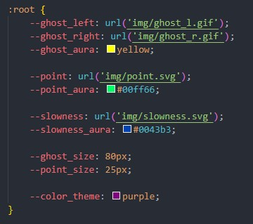
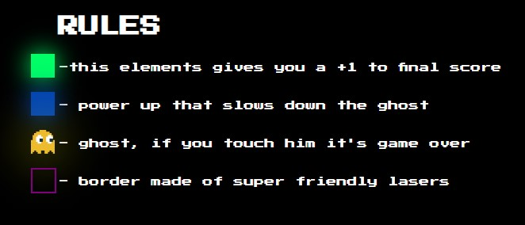
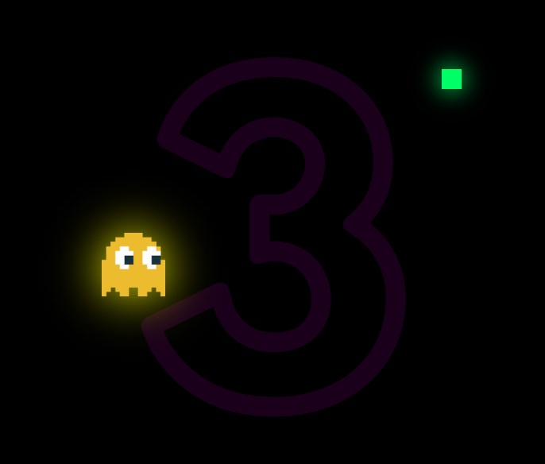

# Ultra Dot

A minimalist JavaScript game where gameplay revolves around the user's cursor position. Its straightforward design makes it highly customizable.


## Run Locally

Clone the project

```bash
  git clone https://github.com/Dzanek309/ultra-dot.git
```

Go to the project directory

```bash
  cd my-project
```

Install dependencies

```bash
  npm install -g serve
```

Start the server

```bash
  serve
```

## Modding

You can customize the visuals of the game.
This where you can change the:
- img of the elements
- aura
- color theme


## Rules and Gameplay






